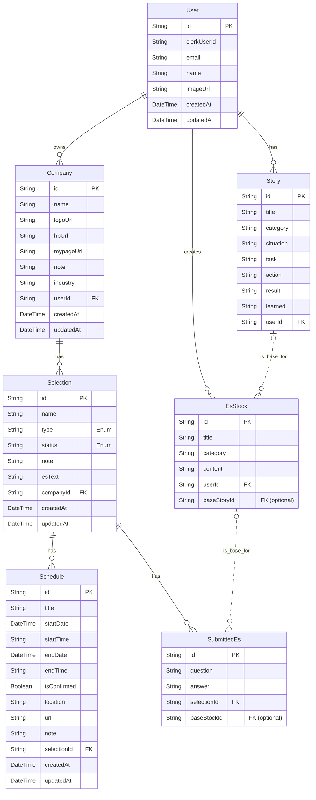

```mermaid
erDiagram
    User {
        String id PK
        String clerkUserId
        String email
        String name
        String imageUrl
        DateTime createdAt
        DateTime updatedAt
    }

    Company {
        String id PK
        String name
        String logoUrl
        String hpUrl
        String mypageUrl
        String note
        String industry
        String userId FK
        DateTime createdAt
        DateTime updatedAt
    }

    Selection {
        String id PK
        String name
        String type "Enum"
        String status "Enum"
        String note
        String esText
        String companyId FK
        DateTime createdAt
        DateTime updatedAt
    }

    Schedule {
        String id PK
        String title
        DateTime startDate
        String startTime
        DateTime endDate
        String endTime
        Boolean isConfirmed
        String location
        String url
        String note
        String selectionId FK
        DateTime createdAt
        DateTime updatedAt
    }

    Story {
        String id PK
        String title
        String category
        String situation
        String task
        String action
        String result
        String learned
        String userId FK
    }

    EsStock {
        String id PK
        String title
        String category
        String content
        String userId FK
        String baseStoryId "FK (optional)"
    }

    SubmittedEs {
        String id PK
        String question
        String answer
        String selectionId FK
        String baseStockId "FK (optional)"
    }

    User ||--o{ Company : "owns"
    User ||--o{ Story : "has"
    User ||--o{ EsStock : "creates"

    Company ||--o{ Selection : "has"

    Selection ||--o{ Schedule : "has"
    Selection ||--o{ SubmittedEs : "has"

    Story |o..o{ EsStock : "is_base_for"
    EsStock |o..o{ SubmittedEs : "is_base_for"
```